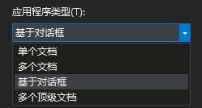
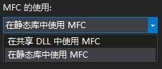

# 写下第一个 MFC 应用程序

## 新建项目

启动 VS2017 后，依次点击菜单栏的「文件」-「新建」-「项目」，并在弹出的「新建项目」对话框中，选择「Visual C++」下的「MFC 应用程序」。

输入项目名称后，依据自己喜好选择是否同时初始化一个 Git 仓库。

接下来弹出的向导中，选择「基于对话框」的应用程序类型。

为了兼容未安装额外运行环境的计算机，我推荐使用静态编译的形式。

接下来的选项可以直接点击「完成」来确认。

## 项目文件的构成

解决方案建立完成后，通过「解决方案资源管理器」可以看到系统生成了一个名为 `HiSanKo` 的解决方案，同时生成了一个名为 `HiSanKo` 的项目。

各文件中应主要关注 `HiSanKoDlg.h`、`HiSanKoDlg.cpp`、`HiSanKo.rc`，分别代表了对话框的头文件、源文件和资源文件。

双击资源文件后，可以在资源列表中展开，点击`Dialog`下的`IDD_HISANKO_DIALOG`即可打开可视化窗口。

## 控件的使用

选中原有的TODO文本，按下键盘上的Delete按键删除它。

拖动工具栏中的`Static Text`到窗口中，保持选中的状态，在属性视图中找到`Caption`选项，将值修改为`Hi`，就可以在窗口中看到文本显示成了`Hi`。

## 程序运行

按下快捷键`Ctrl+F5`运行该程序。

这便是 MFC 的 **Hello World**。

