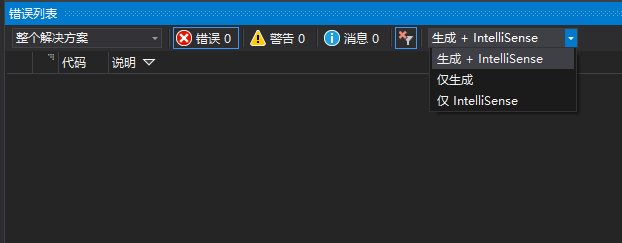

# MFC 开发环境的安装和配置

## 安装 Visual Studio 2017

我推荐使用目前最新版本的 Visual Studio 2017 进行开发。

VS2017 可以在 [微软官网](https://www.visualstudio.com/) 下载到免费的 Community 版本。

安装时选中 C++ 开发套件。

并选中 XP 支持和 MFC 组件。

等待安装完成，该过程大约需要数十分钟。

## 常用操作视图

进入界面之后，在「视图」菜单中选择打开以下菜单，具体位置可以按自己喜好摆放。

工具箱，各种控件即从这里拖出。

团队资源管理器，集成的版本控制系统，支持 Git。

解决方案管理器，整个项目所有文件一目了然。

资源视图，用于打开各个窗口、图像等内容。

属性，快速、方便地设置控件。

错误列表，查看和定位错误。

输出，可以查看各项操作期间的控制台输出内容。

